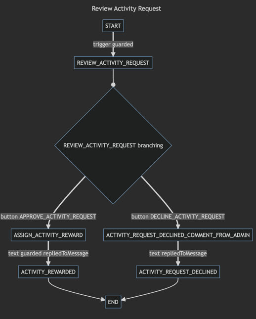
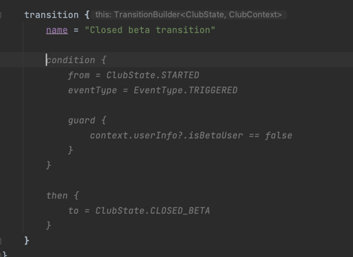

# Chat Machinist


# Creating Efficient Telegram Bots with the Kotlin DSL Library


The Kotlin library chat-machinist simplifies the process of creating Telegram bots by providing a domain-specific language (DSL) for defining bot behavior.

# Creating Efficient Telegram Bots with Kotlin DSL Library

The Kotlin library `chat-machinist` simplifies the process of creating Telegram bots by providing a domain-specific language (DSL) for defining bot behavior.

## Core Concepts

The library uses a state machine approach to manage the flow of bot dialogues.

Users of the library define potential states using Enum classes.

### State Management
Each state defined in an Enum class represents a unique stage in the bot dialogue lifecycle. These states help developers track where the user is in the dialogue and what actions are expected from them. For example, states can be `START`, `HELP`, or `AWAITING_USER_INPUT`.

### Dialogue Buttons
Buttons, for which Enum classes are created, correspond to user actions such as pressing a "next" button or selecting an option in the bot menu. This enables the bot to respond to specific user inputs and perform appropriate transitions between states.

### Dialogue Context
A Data class is used to store information about the current state of the dialogue. It can contain details such as user-entered data or their choice history. Each time a new dialogue is initiated, a new instance of the context is created, allowing for multiple independent dialogues simultaneously.

### DSL for Defining Bot Behavior
The DSL syntax allows developers to define transition rules between states in a convenient and readable format. This includes conditions for starting the dialogue, actions the bot should perform under certain conditions, and instructions on which state to transition to after completing an action.

## Usage example

```kotlin


    enum class TestState {
        STARTED,
        ON_NEXT,
        HELP
    }

    class TestContext {
        var name: String? = null
    }

    enum class TestButtonType {
        GO_NEXT
    }

    @Bean
    fun testChat(): ChatBuilder<TestState, TestContext> =
        chat {
            name = "Test Chat"

            initialContext {
                TestContext()
            }

            commands {
                command {
                    text = "/start"
                    description = "Start the bot"
                }
                command {
                    text = "/help"
                    description = "Get help"
                }
            }

            dialog {
                transition {
                    startDialog = true
                    condition {
                        eventType = EventType.COMMAND
                        text = "/start"
                    }

                    action {
                        // do something
                    }

                    then {
                        //transition to this state if the condition is true and the action is executed
                        to = TestState.STARTED
                    }
                }

                transition {
                    condition {
                        from = TestState.STARTED
                        eventType = EventType.INLINE_BUTTON_CLICKED
                        button = TestButtonType.GO_NEXT
                    }

                    action {
                        name = "John Doe"
                    }

                    then {
                        //transition to this state if the condition is true
                        to = TestState.ON_NEXT
                    }
                }
            }

            dialog {
                transition {
                    startDialog = true
                    condition {
                        eventType = EventType.COMMAND
                        text = "/help"
                    }

                    action {
                        // do something
                    }

                    then {
                        //transition to this state if the condition is true and the action is executed
                        to = TestState.HELP
                    }
                }
            }
        }
```

## Bot Messages

The library also allows defining bot messages using DSL.
When generating messages, the dialogue context is accessible.

### Example

```koltin
    reply {
        state = ClubState.MENU
        disableLinkPreview = true

        message {
            text = """
                ${context.userInfo?.firstName?.let { "Привет, $it!"}?:""}
                Узнай про Клуб амбассадоров больше на сайте https://club.redmadrobot.kz/ 
                или отправляй свой запрос ниже:
                """.trimIndent()

            keyboard {
                inline = true

                buttonRow {
                    button {
                        text = "Сколько у меня жетонов?"
                        type = ClubButtonType.VIEW_WALLET
                    }
                }

                buttonRow {
                    button {
                        text = "Получить жетоны"
                        type = ClubButtonType.ACTIVITIES
                    }

                    button {
                        text = "Купить мерч"
                        type = ClubButtonType.VIEW_MERCH_LIST
                    }
                }

                buttonRow {
                    button {
                        text = "Хочу спросить"
                        type = ClubButtonType.ASK_FOR_HELP
                    }
                }
            }
        }
    }
```

## Intermediate States

Sometimes, a single user action requires multiple actions and transitions.

### Example
When an HTTP request needs to be made and the bot should transition to a positive state or a negative state depending on the result of the request, intermediate states and transition triggers should be used.

```kotlin
    dialog {
        transition {
            condition {
                from = TestState.STARTED
                eventType = EventType.INLINE_BUTTON_CLICKED
                button = TestButtonType.GO_NEXT
            }

            action {
                context.httpResponse = service.makeRequest()
            }

            then {
                //transition to this state if the condition is true
                to = TestState.SERVICE_RESPONSE_RECEIVED
                noReply = true

                trigger {
                    sameDialog = true
                }
            }
        }

        transition {
            condition {
                from = TestState.SERVICE_RESPONSE_RECEIVED
                eventType = EventType.TRIGGERED
                
                guard {
                    context.httpResponse?.isSuccess == true
                }
            }
    
            then {
                //transition to this state if the condition is true
                to = TestState.SUCCESS
            }
        }
        
        transition {
            condition {
                from = TestState.SERVICE_RESPONSE_RECEIVED
                eventType = EventType.TRIGGERED
                
                guard {
                    context.httpResponse?.isSuccess == false
                }
            }
    
            then {
                //transition to this state if the condition is true
                to = TestState.ERROR
            }
        }
    }
``` 

## Transition Visualization

This description of possible transitions allows the library to build a graph of state transitions.
The visualization is powered by the Mermaid library.

Visualization can be enabled via `application.yaml`.

```yaml
chat-machinist:
  visualize: true
```
Тогда генерируется файлы визуализации для каждого диалога в папке mermaid в корне проекта



## State Storage

State machine storage is handled via `PersistenceService`.
By default, an in-memory implementation is used, but MongoDB can also be utilized.

### Example
```yaml
chat-machinist:
  persistence:
    type: mongodb
```
or 
```yaml
chat-machinist:
  persistence:
    type: in-memory
```

## Testing

The library allows testing the bot using a special class `UpdateBuilder`.

The response returns a list of `UpdateResponse`, which contains information about the request processing status and the message sent to the user.### Example


```kotlin
@SpringBootTest
@ActiveProfiles("test")
class ClubStoreIntegrationTest {

    @Autowired
    private lateinit var bot: ChatMachinistBot<ClubState, ClubContext>

    @MockBean
    private lateinit var telegramClient: TelegramClient

    val testUser = User().apply {
        id = 1
        firstName = "Test"
        lastName = "User"
        userName = "testuser"

    }

    val testChat = Chat().apply {
        id = 1
        title = "Test Chat"
        userName = "testchat"
        type = "private"
    }

    @Test
    fun should_complete_happy_path() {
        start()
    }

    private fun start() {
        // given
        Mockito.`when`(telegramClient.getChatMember(Mockito.any())).thenReturn(
            ChatMemberMember()
        )

        // when
        val updateResponses = bot
            .handle(
                UpdateBuilder(testUser, testChat)
                    .fromText("/start")
            )!!

        // then
        Assertions.assertEquals(2, updateResponses.size)
        Assertions.assertEquals(UpdateStatus.SUCCESS, updateResponses[0].status)
        Assertions.assertEquals(UpdateStatus.SUCCESS, updateResponses[1].status)
    }
}

```

## Full configuration example

```yaml
chat-machinist:
  visualize: true
  persistence:
    type: mongodb
  bot:
    name: club_store_test_bot
    token: 6330201904:AAG_4zOqId526Bboux_ShMqkyUFcxOasqw
```

## AI Assistance

Since the DSL defines a declarative description of transitions, tools like ChatGPT or GitHub Copilot can help you generate code for handling transitions.

### Example Using GitHub Copilot

Code generated by GitHub Copilot is highlighted in gray.

From the English description of a transition, the AI understands the conditions that need to be established for the transition.




